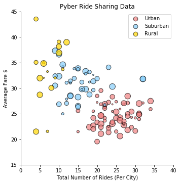
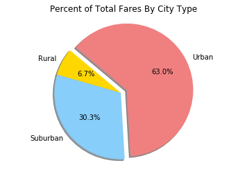
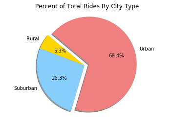
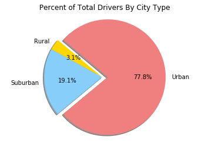

```python
# ANALYSIS
# 
# Observation #1
#
# Looking at the Percent of Total Rides By City Type Graph and the Percent of Total Fares By City Type Graph, it seems
# that the percent of fares for suburban drivers was greater than the percent of suburban drivers. In contrast, the 
# percent of fares for urban drivers was less than the percent of urban drivers. This likely means that suburban 
# drivers earn more on average and are more efficient. This is probably due to their medium length trips rather than 
# very short trips in urban areas. 
#
# Observation #2
#
# Looking at the scatter plot, it appears that there is a negative relationship between Average Fares and Total Drivers
# in cities. More drivers likely means high but concentrated demand. Concentration reduces trip length, which reduces
# average fares. A driver might prefer working in a rural city.
# 
# Observation #3
#
# Looking at the Total Drivers by City graph and the Total Rides by City graph, it appears that in urban areas the 
# supply of drivers exceeds the demand for rides, as the urban percent of total drivers exceeds the percent of total 
# rides. 
# 
#


```


```python
import pandas as pd
import matplotlib as mp
import numpy as np
import matplotlib.pyplot as plt
import seaborn as sns
```


```python
cityPath = "../Pyber/raw_data/city_data.csv"
cityFile = pd.read_csv(cityPath)
cityFile = cityFile.dropna(axis=0, how='any')

ridePath = "../Pyber/raw_data/ride_data.csv"
rideFile = pd.read_csv(ridePath)
rideFile = rideFile.dropna(axis=0, how='any')
```


```python
cityFile.head()
newCityFile = cityFile.drop('city',1)
#newCityFile.head()

```


```python
sumOfDriversByCity = newCityFile.groupby('type').sum()
#sumOfDriversByCity.head()
```


```python
#rideFile.head()
#cityType = cityFile.drop("driver_count", 1)
#cityType.head()
```


```python
#average fare per city
rideCityGroup = rideFile.groupby("city").mean()
avgFarePerCity = rideCityGroup.drop('ride_id', 1)
#avgFarePerCity.head()
```


```python
# total rides per city
rideCityGroupCount = rideFile.groupby("city").count()
ridesPerCity = rideCityGroupCount.drop(['date','fare'], 1)
#ridesPerCity.head()
```


```python
#merge the 2 datasets
result = avgFarePerCity.join(ridesPerCity)
#result.head()
```


```python
#first chunk complete
result = cityFile.join(result,on='city')
result = result.set_index('city')
#result.head()
```


```python
totalDrivers = result['driver_count'].sum()
```


```python
# add percDrivers column
# driver_count is number of drivers in city
# ride_id is number of rides in city
# percDrivers is (driver_count/totalDrivers) for each city
# fare is average fare taken from all rides in city

result['percDrivers'] = result.apply(lambda row: (row.driver_count /totalDrivers)*100, axis=1)
result.head()
```


<div>
<style>
    .dataframe thead tr:only-child th {
        text-align: right;
    }

    .dataframe thead th {
        text-align: left;
    }

    .dataframe tbody tr th {
        vertical-align: top;
    }
</style>
<table border="1" class="dataframe">
  <thead>
    <tr style="text-align: right;">
      <th></th>
      <th>driver_count</th>
      <th>type</th>
      <th>fare</th>
      <th>ride_id</th>
      <th>percDrivers</th>
    </tr>
    <tr>
      <th>city</th>
      <th></th>
      <th></th>
      <th></th>
      <th></th>
      <th></th>
    </tr>
  </thead>
  <tbody>
    <tr>
      <th>Kelseyland</th>
      <td>63</td>
      <td>Urban</td>
      <td>21.806429</td>
      <td>28</td>
      <td>1.881159</td>
    </tr>
    <tr>
      <th>Nguyenbury</th>
      <td>8</td>
      <td>Urban</td>
      <td>25.899615</td>
      <td>26</td>
      <td>0.238877</td>
    </tr>
    <tr>
      <th>East Douglas</th>
      <td>12</td>
      <td>Urban</td>
      <td>26.169091</td>
      <td>22</td>
      <td>0.358316</td>
    </tr>
    <tr>
      <th>West Dawnfurt</th>
      <td>34</td>
      <td>Urban</td>
      <td>22.330345</td>
      <td>29</td>
      <td>1.015228</td>
    </tr>
    <tr>
      <th>Rodriguezburgh</th>
      <td>52</td>
      <td>Urban</td>
      <td>21.332609</td>
      <td>23</td>
      <td>1.552702</td>
    </tr>
  </tbody>
</table>
</div>


```python
typeCity = result.groupby(['type'])

```


```python
# library & dataset
import seaborn as sns
df = result

colors = ['lightcoral', 'lightskyblue', 'gold']
size = result['driver_count'].values
size = np.array(size, dtype=int)
# Use the 'hue' argument to provide a factor variable -- SIZE??
g = sns.lmplot( x="ride_id", y="fare", data=df, fit_reg=False, hue='type', scatter_kws={"alpha":0.7,"s":size*2,'linewidths':1,'edgecolor':'black'},palette=colors, legend=False)

ax = plt.gca()
ax.set_title("Pyber Ride Sharing Data")


g.set_axis_labels("Total Number of Rides (Per City)","Average Fare $")
plt.ylim(15, 45)
plt.xlim(0, 40)

#g.set_axis_title('Pyber Ride Sharing Data', fontsize=20,color="r",alpha=0.5)


 
# Move the legend to an empty part of the plot
plt.legend(loc='upper right')
 
plt.show()
```





```python
#% of Total Fares by City Type
urbanCount = 0
ruralCount = 0
suburbCount = 0

for x in result['type']:
    if(x == 'Urban'):
        urbanCount = urbanCount + 1
    elif(x == 'Rural'):
        ruralCount = ruralCount + 1
    elif(x == 'Suburban'):
        suburbCount = suburbCount + 1
    else:
        #do nothing
        print('no type')
    
ruralCount
```


    18


```python
rideCityType = []
numberOfRides = 0

for x in rideFile['city']:
    typeOfCity = (cityFile.loc[cityFile['city'] == x, 'type']).values[0]
    rideCityType.append(typeOfCity)
    numberOfRides = numberOfRides + 1
    
list(rideCityType)

rideFile['type'] = rideCityType
#rideFile.head()
```


```python
#PERCENT OF TOTAL FARES PER CITY TYPE

cityFareSums = rideFile.groupby('type').sum()
#cityFareSums
```


```python
#PERCENT OF TOTAL FARES PER CITY TYPE
cityFares = cityFareSums.drop('ride_id',1)
cityFares = cityFares.rename(columns={"fare": "TotalFares"})
#cityFares
```


```python
#PERCENT OF TOTAL FARES PER CITY TYPE
totalFares = 0

farePercentages = []
#get total fares
for x in cityFares['TotalFares']:
    totalFares = totalFares + x
for x in cityFares['TotalFares']:
    percent = (x/totalFares)*100
    farePercentages.append(percent)

cityFares['Percent'] = farePercentages
#cityFares
```


```python
# Percent of Total Fares By City Type Pie Chart
# Data to plot
labels = 'Rural', 'Suburban', 'Urban'
sizes = cityFares['TotalFares']
colors = ['gold', 'lightskyblue', 'lightcoral']
explode = (0, 0, 0.1)  # explode 1st slice
 
# Plot
plt.pie(sizes, explode=explode, labels=labels, colors=colors,
        autopct='%1.1f%%', shadow=True, startangle=140)
 
plt.axis('equal')
plt.title("Percent of Total Fares By City Type")
plt.show()
```





```python
#sum of rides by city type table
cityRideSums = rideFile.groupby('type').count()
#cityRideSums
```


```python
# Percent of Total Rides By City Type Pie Chart
# Data to plot
labels = 'Rural', 'Suburban', 'Urban'
sizes = cityRideSums['ride_id']
colors = ['gold', 'lightskyblue', 'lightcoral']
explode = (0, 0, 0.1)  # explode 1st slice
 
# Plot
plt.pie(sizes, explode=explode, labels=labels, colors=colors,
        autopct='%1.1f%%', shadow=True, startangle=140)
 
plt.axis('equal')
plt.title("Percent of Total Rides By City Type")
plt.show()
```





```python
sumOfDriversByCity
# Percent of Total Rides By City Type Pie Chart
# Data to plot
labels = 'Rural', 'Suburban', 'Urban'
sizes = sumOfDriversByCity['driver_count']
colors = ['gold', 'lightskyblue', 'lightcoral']
explode = (0, 0, 0.1)  # explode 1st slice
 
# Plot
plt.pie(sizes, explode=explode, labels=labels, colors=colors,
        autopct='%1.1f%%', shadow=True, startangle=140)
 
plt.axis('equal')
plt.title("Percent of Total Drivers By City Type")
plt.show()
```




